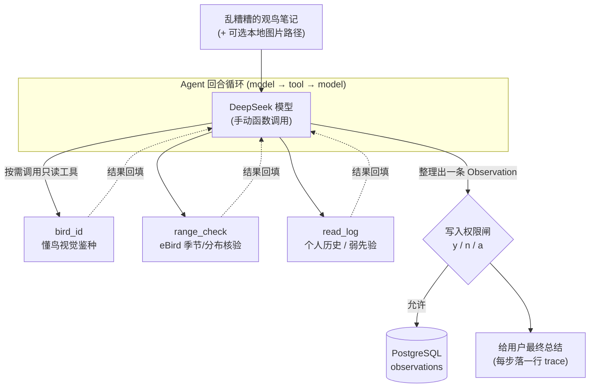

# Vibirding · 观鸟速记 Agent

> 在野外随手丢一句乱糟糟的观鸟笔记，程序自动把它整理成一条**结构化观测记录**，
> 必要时调工具做视觉鉴种 / 季节分布核验 / 查个人历史，经**写入权限闸**落盘成日志，之后还能查回。

一个**个人级**的单 agent + 工具循环项目。
循环、工具协议、权限、预算、可观测 trace、固定 eval。运行时大模型是 **DeepSeek**（OpenAI 兼容端点，手动函数调用）。

---

## 它解决什么问题

野外记录鸟况时你只想快速丢一句 `傍晚 葛西临海公园 家燕 十几只 低空飞`，
不想当场填表。Vibirding 把这句自然语言笔记：

- 抽成结构化字段（地点 / 日期 / 时段 / 种 / 数量 / 行为 / 原文…）；
- 拿不准种时，调**懂鸟**做图片鉴种、或调 **eBird** 取当地当季物种清单再挑种；
- 按"用户指定 > 图片鉴定 > 描述推断"的优先级裁决物种来源；
- 写入前**必须经你确认**，然后事务化保存到 PostgreSQL；
- 之后你可以直接问"我在某地记录过哪些鸟"，它查日志回答。

---

## 功能亮点

- **三路鉴定 + 优先级裁决**：用户指定种名 / 图片鉴种（bird_id）/ 描述推断（经 range_check 核验），冲突时按规则打 flag。
- **eBird 季节/分布核验**：`range_check` 取该地近期实际记录的物种清单，把"开放式鸟类学问答"收敛成"清单内选择题"。
- **懂鸟视觉鉴种**：`bird_id` 对本地图片做鉴种（异步两步 + 轮询全封装在工具内）。
- **写入权限闸**：唯一的写工具 `append_log` 执行前必须过闸（真人 y/n/a，或 `--yes` 自动）。
- **预算与容错**：步数 + token 双上限、优雅收尾；工具失败统一归一化、不崩循环。
- **结构化 trace**：每一步落一行 JSONL，既是 debug 工具也是"这个 agent 想了什么"的回放。
- **两档 eval**：固定用例集一条命令出通过率（离线回归保险 / 在线真实质量）。

---

## 架构与数据流

单 agent 围绕 `model → tool → model` 一个回合循环组织；所有工具走同一套"注册 → 校验 → 执行 → 归一化 `{ok, output}`"。



| 工具          | 读/写     | 作用                                                   |
| ------------- | --------- | ------------------------------------------------------ |
| `read_log`    | read      | 查你自己的历史观测（个人弱先验）                       |
| `range_check` | read      | 该地近期 eBird 实际记录的物种清单（权威季节/分布核验） |
| `bird_id`     | read      | 本地图片 → 候选鸟种 + 置信度（懂鸟）                   |
| `append_log`  | **write** | 写入一条 Observation（**唯一过权限闸的工具**）         |

> 把乱笔记整理成结构化字段**不是一个工具**，而是模型的本职——它推理后直接把结果填进 `append_log` 的参数里。

完整设计见 [docs/architecture.md](docs/architecture.md)（唯一事实来源）。

---

## 快速开始

需要 Python 3.10+ 和 Docker Desktop。

```bash
git clone <this-repo> && cd Vibirding
python -m venv .venv
# Windows PowerShell: .venv\Scripts\Activate.ps1
# Linux/macOS:        source .venv/bin/activate
pip install -r requirements.txt

Copy-Item .env.example .env   # PowerShell；然后编辑 .env
docker compose up -d postgres
python -m alembic upgrade head
python scripts/import_ebird_taxonomy.py
```

以上三条命令分别负责启动本地 PostgreSQL、把数据库结构升级到当前版本，以及从 eBird
幂等导入当前物种名录。`DATABASE_URL` 已在 `.env.example` 中给出本地默认值。

**启动当前 Web API（v2 3.1–3.8）**：

```bash
python -m uvicorn vibirding.api.app:create_app --factory --reload
```

启动后可打开 <http://127.0.0.1:8000/docs>，在交互文档中使用 `POST /api/media` 上传
`photo`。当前只接受不超过 2 MiB 的 JPEG；文件按内容哈希去重，并可通过响应里的
`/media/<hash>.jpg` 地址读取。命令行也可以这样上传：

```bash
curl.exe -F "photo=@D:\path\bird.jpg;type=image/jpeg" http://127.0.0.1:8000/api/media
```

上传得到 `media_id` 后，可以在交互文档中调用 `POST /api/parse`：

```json
{
  "text": "今天在井之头公园看到3只灰喜鹊和两只鸬鹚",
  "media_ids": ["上传接口返回的 media_id"]
}
```

它会同步完成文本拆分、照片鉴种、物种名录匹配并返回确认前预览。这个接口不会写入观测；
真实图文解析需要在 `.env` 配置 `DEEPSEEK_API_KEY`，带照片时还需要 `HHO_API_KEY`。

检查并按需编辑返回的 `draft_observations` 后，调用 `POST /api/observations`：

```json
{
  "text": "原始整篇笔记",
  "media_ids": ["本批次的全部 media_id"],
  "observations": ["/api/parse 返回并经用户确认的草稿对象"],
  "confirmed": true
}
```

只有 JSON 布尔值 `true` 会触发写入。接受确认后返回 201；`created` 列出成功记录，`failed`
列出逐条失败原因，因此部分失败不会丢掉已经成功的记录。

写入后可以直接读取最近记录，不经过大模型：

```text
GET /api/observations?limit=10
GET /api/observations?place=井之头&species=灰喜鹊&date_from=2026-09-01&date_to=2026-09-30
GET /api/observations/<observation_id>
```

列表按最新记录优先，返回照片数量和缩略图 URL；详情另外返回全部照片以及该记录所属 session
的整篇原始笔记。查询只读取 PostgreSQL，不消耗 DeepSeek、懂鸟或 eBird API 配额。

管理页可以只提交需要修改的字段：

```http
PATCH /api/observations/<observation_id>
Content-Type: application/json

{
  "place": "葛西临海公园",
  "obs_date": "2026-09-05",
  "count": 7,
  "behavior": "潜水觅食"
}
```

成功返回更新后的完整详情。编辑不会改变记录 ID、创建时间、来源、session 或照片归属；不传的
字段保持原值，可空字段传 `null` 才会被清除。

删除单条记录使用：

```text
DELETE /api/observations/<observation_id>
```

成功返回空响应 `204 No Content`。删除 observation 不会删除它所属的 session、照片元数据或
磁盘图片；照片只会解除与该 observation 的关联，媒体 URL 仍可访问。

编辑表单的物种联想直接查询本地名录：

```text
GET /api/species?q=乌鸦
GET /api/species?q=Corvus&limit=10
```

它会搜索规范中文名、科学名和别名，并按完全匹配、前缀匹配、子串匹配排序。默认最多返回
20 条，不调用 eBird 网络，因此不会消耗 API 配额。

**API key（在 `.env` 里配）**：

| 变量               | 是否必需              | 用途                                     | 申请                             |
| ------------------ | --------------------- | ---------------------------------------- | -------------------------------- |
| `DEEPSEEK_API_KEY` | **必需**              | 运行时大模型                             | <https://platform.deepseek.com/> |
| `EBIRD_API_KEY`    | range_check/名录导入需要 | eBird 季节分布与物种名录              | <https://ebird.org/api/keygen>   |
| `HHO_API_KEY`      | 仅带 `--image` 时需要 | 懂鸟视觉鉴种（免费额度约 50 次，省着用） | <https://ai.open.hhodata.com/>   |

**跑一条**（记得从仓库根、用 venv 的 python）：

```bash
python -m vibirding "傍晚葛西临海公园家燕十几只在低空飞"
```

**离线 eval**（不需要任何 API key 或外部网络，但需要本地 PostgreSQL）：

```bash
python evals/run_evals.py     # 离线 eval，应 13/13
```

**API 总体验收**（同样不调用外部 provider，但会启动一个临时 Uvicorn 服务）：

```bash
python scripts/check_v2_api_acceptance.py     # 应 37/37
```

该脚本使用独立临时数据库 schema 和媒体目录，通过真实 HTTP 走完上传、解析、确认、读取、
物种查询、编辑和删除；结束后会自动清理测试数据。

**启动本地网页（另开一个终端，先保持 FastAPI 正在运行）：**

```bash
cd frontend
npm install
npm run dev
```

浏览器打开 <http://127.0.0.1:5173/>。网页开发服务器会把 `/api` 和 `/media` 自动转发给
`http://127.0.0.1:8000`；需要修改目标时，复制 `frontend/.env.example` 为 `.env` 后调整
`VITE_API_TARGET`。当前 3.9 只包含两个响应式页面骨架，业务交互从 3.10 开始接入。

---

## 用法

统一入口 `python -m vibirding "<文本>" [选项]`。**记录**还是**查询**由模型自己判断，不用记子命令：

```bash
# 记录一条新观测（结尾会调 append_log 写盘，写前问你 y/n/a）
python -m vibirding "早上 葛西临海公园 大嘴乌鸦 3只"

# 查询历史（只调 read_log 读回、不写盘）
python -m vibirding "我在葛西临海公园记录过哪些鸟"

# 带一张本地图片做视觉鉴种
python -m vibirding "水元公园一只小鸟腹部橙红抖尾" --image bird.jpg
```

选项：

| 选项            | 作用                                    |
| --------------- | --------------------------------------- |
| `--image PATH`  | 附一张本地鸟类图片，交给 bird_id        |
| `-y, --yes`     | 自动同意写入，跳过确认（演示 / 脚本化） |
| `-v, --verbose` | 打印完整分步 trace（默认只打简洁结果）  |
| `--max-steps N` | 单回合步数预算（默认 6）                |

每次运行都会在 `data/traces/` 落一份 JSONL 轨迹，可事后回看每一步。

---

## Eval：通过率是量化出来的，不是"我试了下好像行"

固定用例集 13 条（`evals/tasks.yaml` 题目 + `evals/answers.yaml` 答案，**分文件防泄题**），一条命令出通过率：

| 档   | 命令                                 | 结果              | 含义                                                                                |
| ---- | ------------------------------------ | ----------------- | ----------------------------------------------------------------------------------- |
| 离线 | `python evals/run_evals.py`          | **13/13 = 100%**  | MockClient + 桩工具 + PostgreSQL 临时 schema；零外部网络/零 key → **回归保险** |
| 在线 | `python evals/run_evals.py --online` | **11/13 = 84.6%** | 低温真 DeepSeek + 真工具 → **真实识别质量指标**（允许非满分）                       |

两条在线未过用例的逐条归因见 [evals/REPORT.md](evals/REPORT.md)。

---

## 设计取舍（几条代表性的）

- **手写 agent harness，不用 LangChain 等框架**——个人级单 agent，逻辑就一个回合循环；手写才能把每一步看懂、可控、可测。
- **写入类操作过权限闸，且闸在执行路径内**——写入是唯一不可逆操作，"未经同意绝不落盘"必须内建、不能事后补。
- **PostgreSQL 由 SQLAlchemy + Alembic 管理**——运行时用 ORM/repository 保持业务边界，数据库结构通过版本化 migration 演进。
- **季节核验是主 agent 调的普通工具，不是核验子 agent**——它只是"取一份数据"，单步无状态，工具契约已够，子 agent 会凭空加复杂度。

完整取舍记录见 [DECISIONS.md](DECISIONS.md)。

---

## 已知边界（诚实写）

- **用户指定种名时不必然做季节核验**：如"7 月的红嘴鸥"（反常）——模型可能直接采信用户种名而不调 range_check 标 `season_unusual`（eval t04）。
- **模糊量词不估值**："十几只 / 几只"这类会被留空，不折算成整数（eval t02）。
- **正式 CLI 仍是单条笔记 → 单条记录**：v2 批量处理服务链已经完成，但要等第 3 步
  API/UI 后才成为用户入口。
- **read_log 起步为空**：个人历史要攒；起步阶段鉴种主力是 bird_id + range_check。
- **懂鸟免费额度约 50 次**：带图鉴种省着用。

---

## 项目结构

```
vibirding/          # 主包：cli 入口 + 循环 + 工具 + 记忆 + harness + llm 适配
├── cli.py          #   统一入口（python -m vibirding）
├── agent/          #   loop.py 回合循环 · prompt.py 系统提示
├── tools/          #   registry + read_log/range_check/bird_id/append_log
├── db/             #   SQLAlchemy session / ORM / repository
├── services/       #   文本/照片解析、名录匹配、预览组装、批量确认写入
├── api/            #   FastAPI 工厂与 3.1–3.7 HTTP 接口
├── memory/         #   log.py：保持 v1 append/query 外观
├── harness/        #   permissions / budget / trace
└── llm/            #   deepseek_client（运行时）· mock（离线）· client（Gemini 备用）
migrations/         # Alembic 数据库结构版本
evals/              # 固定用例 + run_evals.py 两档打分 + REPORT.md
scripts/            # check_sX/check_v2_db 自检 + 少量专项手动入口
docs/               # architecture.md（唯一事实来源）· STATUS.md（进度快照）
data/               # gitignore：运行时 JSONL trace（按需自动创建）
docker-compose.yml  # 本地 PostgreSQL 服务
frontend/           # Vite + React + TypeScript 双页 Web 应用
```

---

## v2 后续计划

- **2.1–2.3 已完成并提交**：文本拆分、照片预处理、物种名录与 dry-run 匹配。
- **2.4 已完成并提交**：批量确认写入、部分成功和会话/照片关联。
- **2.5 已完成并提交**：未匹配照片自动生成预览草稿。
- **3.1 已完成并提交**：FastAPI 媒体上传、内容哈希去重、文件读取 URL。
- **3.2 已完成并提交**：FastAPI 同步解析预览，串联文本、照片、名录匹配和草稿组装。
- **3.3 已完成并提交**：FastAPI 明确确认后的批量写入、事务与部分成功响应。
- **3.4 已完成并提交**：FastAPI 最新记录列表、筛选、照片与 session 详情读取。
- **3.5 已完成并提交**：FastAPI 观测记录局部编辑与事务回滚。
- **3.6 已完成并提交**：FastAPI 单条观测删除，并保留 session 与媒体审计。
- **3.7 已完成并提交**：FastAPI 本地物种名录查询与稳定相关度排序。
- **3.8 已完成并提交**：真实 Uvicorn 下的 API 完整生命周期、OpenAPI 与全量回归验收。
- **3.9 已实现、待 review**：React + TypeScript 基础工程、双路由、共享设计 token、API client 与开发代理。
- **2.6 待补齐**：增加原始需求承诺的 v2 固定离线 eval；3.9 提交后优先执行。
- **3.10**：实现输入流程，包括上传、解析预览、草稿编辑和确认写入。
- **3.11**：实现记录管理流程，包括筛选、详情、物种联想、编辑和删除。
- **3.12**：完成两页端到端、视觉、键盘、触控和响应式总体验收。
- **4**：最终文档与全量回归，用户确认后打 `v2.0` tag。

完整范围与切片顺序见 [docs/architecture.md](docs/architecture.md) §10。
