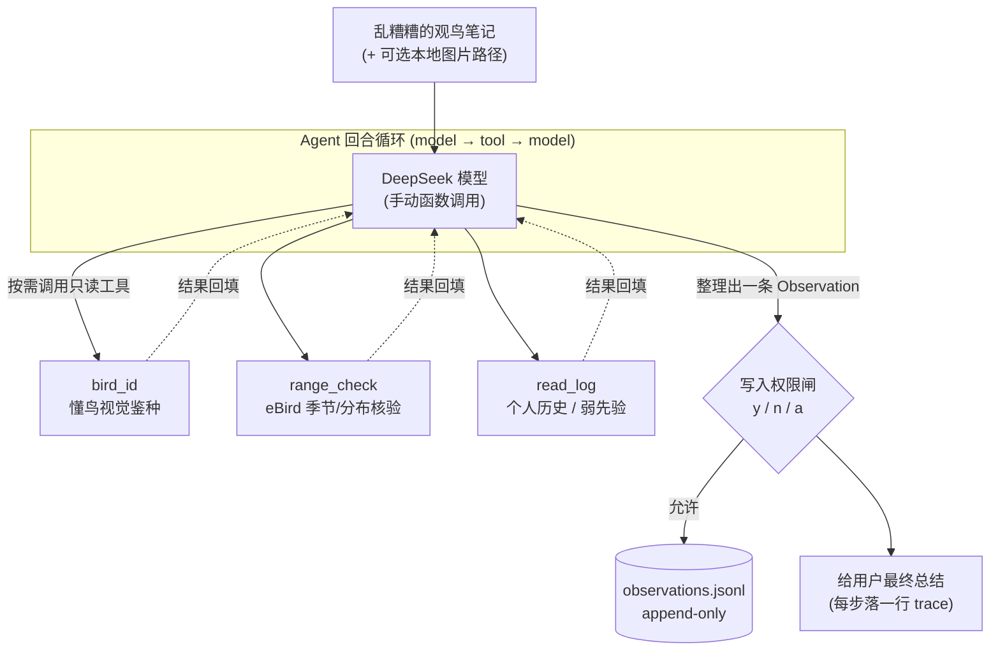

# Vibirding · 观鸟速记 Agent

> 在野外随手丢一句乱糟糟的观鸟笔记，程序自动把它整理成一条**结构化观测记录**，
> 必要时调工具做视觉鉴种 / 季节分布核验 / 查个人历史，经**写入权限闸**落盘成日志，之后还能查回。

一个**个人级**的单 agent + 工具循环项目。
循环、工具协议、权限、预算、可观测 trace、固定 eval。运行时大模型是 **DeepSeek**（OpenAI 兼容端点，手动函数调用）。

---

## 它解决什么问题

野外记录鸟况时你只想快速丢一句 `傍晚 葛西临海公园 家燕 十几只 低空飞`，
不想当场填表。Vibirding 把这句自然语言笔记：

- 抽成结构化字段（地点 / 日期 / 时段 / 种 / 数量 / 行为 / 原文…）；
- 拿不准种时，调**懂鸟**做图片鉴种、或调 **eBird** 取当地当季物种清单再挑种；
- 按"用户指定 > 图片鉴定 > 描述推断"的优先级裁决物种来源；
- 写盘前**必须经你确认**，落成 append-only 的 `observations.jsonl`；
- 之后你可以直接问"我在某地记录过哪些鸟"，它查日志回答。

---

## 功能亮点

- **三路鉴定 + 优先级裁决**：用户指定种名 / 图片鉴种（bird_id）/ 描述推断（经 range_check 核验），冲突时按规则打 flag。
- **eBird 季节/分布核验**：`range_check` 取该地近期实际记录的物种清单，把"开放式鸟类学问答"收敛成"清单内选择题"。
- **懂鸟视觉鉴种**：`bird_id` 对本地图片做鉴种（异步两步 + 轮询全封装在工具内）。
- **写入权限闸**：唯一的写工具 `append_log` 执行前必须过闸（真人 y/n/a，或 `--yes` 自动）。
- **预算与容错**：步数 + token 双上限、优雅收尾；工具失败统一归一化、不崩循环。
- **结构化 trace**：每一步落一行 JSONL，既是 debug 工具也是"这个 agent 想了什么"的回放。
- **两档 eval**：固定用例集一条命令出通过率（离线回归保险 / 在线真实质量）。

---

## 架构与数据流

单 agent 围绕 `model → tool → model` 一个回合循环组织；所有工具走同一套"注册 → 校验 → 执行 → 归一化 `{ok, output}`"。



| 工具          | 读/写     | 作用                                                   |
| ------------- | --------- | ------------------------------------------------------ |
| `read_log`    | read      | 查你自己的历史观测（个人弱先验）                       |
| `range_check` | read      | 该地近期 eBird 实际记录的物种清单（权威季节/分布核验） |
| `bird_id`     | read      | 本地图片 → 候选鸟种 + 置信度（懂鸟）                   |
| `append_log`  | **write** | 写入一条 Observation（**唯一过权限闸的工具**）         |

> 把乱笔记整理成结构化字段**不是一个工具**，而是模型的本职——它推理后直接把结果填进 `append_log` 的参数里。

完整设计见 [docs/architecture.md](docs/architecture.md)（唯一事实来源）。

---

## 快速开始

需要 Python 3.10+。

```bash
git clone <this-repo> && cd Vibirding
python -m venv .venv
# Windows PowerShell: .venv\Scripts\Activate.ps1
# Linux/macOS:        source .venv/bin/activate
pip install -r requirements.txt

cp .env.example .env      # 然后编辑 .env 填入你的 key（见下）
```

**API key（在 `.env` 里配）**：

| 变量               | 是否必需              | 用途                                     | 申请                             |
| ------------------ | --------------------- | ---------------------------------------- | -------------------------------- |
| `DEEPSEEK_API_KEY` | **必需**              | 运行时大模型                             | <https://platform.deepseek.com/> |
| `EBIRD_API_KEY`    | 调 range_check 时需要 | eBird 季节/分布数据                      | <https://ebird.org/api/keygen>   |
| `HHO_API_KEY`      | 仅带 `--image` 时需要 | 懂鸟视觉鉴种（免费额度约 50 次，省着用） | <https://ai.open.hhodata.com/>   |

**跑一条**（记得从仓库根、用 venv 的 python）：

```bash
python -m vibirding "傍晚葛西临海公园家燕十几只在低空飞"
```

**零配置自检**（不需要任何 key、不联网）：

```bash
python evals/run_evals.py     # 离线 eval，应 13/13
```

---

## 用法

统一入口 `python -m vibirding "<文本>" [选项]`。**记录**还是**查询**由模型自己判断，不用记子命令：

```bash
# 记录一条新观测（结尾会调 append_log 写盘，写前问你 y/n/a）
python -m vibirding "早上 葛西临海公园 大嘴乌鸦 3只"

# 查询历史（只调 read_log 读回、不写盘）
python -m vibirding "我在葛西临海公园记录过哪些鸟"

# 带一张本地图片做视觉鉴种
python -m vibirding "水元公园一只小鸟腹部橙红抖尾" --image bird.jpg
```

选项：

| 选项            | 作用                                    |
| --------------- | --------------------------------------- |
| `--image PATH`  | 附一张本地鸟类图片，交给 bird_id        |
| `-y, --yes`     | 自动同意写入，跳过确认（演示 / 脚本化） |
| `-v, --verbose` | 打印完整分步 trace（默认只打简洁结果）  |
| `--max-steps N` | 单回合步数预算（默认 6）                |

每次运行都会在 `data/traces/` 落一份 JSONL 轨迹，可事后回看每一步。

---

## Eval：通过率是量化出来的，不是"我试了下好像行"

固定用例集 13 条（`evals/tasks.yaml` 题目 + `evals/answers.yaml` 答案，**分文件防泄题**），一条命令出通过率：

| 档   | 命令                                 | 结果              | 含义                                                                                |
| ---- | ------------------------------------ | ----------------- | ----------------------------------------------------------------------------------- |
| 离线 | `python evals/run_evals.py`          | **13/13 = 100%**  | MockClient + 桩工具，零网络/零 key；据答案合成"理想模型"驱动真实循环 → **回归保险** |
| 在线 | `python evals/run_evals.py --online` | **11/13 = 84.6%** | 低温真 DeepSeek + 真工具 → **真实识别质量指标**（允许非满分）                       |

两条在线未过用例的逐条归因见 [evals/REPORT.md](evals/REPORT.md)。

---

## 设计取舍（几条代表性的）

- **手写 agent harness，不用 LangChain 等框架**——个人级单 agent，逻辑就一个回合循环；手写才能把每一步看懂、可控、可测。
- **写入类操作过权限闸，且闸在执行路径内**——写入是唯一不可逆操作，"未经同意绝不落盘"必须内建、不能事后补。
- **季节核验是主 agent 调的普通工具，不是核验子 agent**——它只是"取一份数据"，单步无状态，工具契约已够，子 agent 会凭空加复杂度。

完整 12 条取舍（含"为什么 JSONL 不用数据库""为什么手动函数调用不用 SDK 自动执行"）见 [DECISIONS.md](DECISIONS.md)。

---

## 已知边界（诚实写）

- **用户指定种名时不必然做季节核验**：如"7 月的红嘴鸥"（反常）——模型可能直接采信用户种名而不调 range_check 标 `season_unusual`（eval t04）。
- **模糊量词不估值**："十几只 / 几只"这类会被留空，不折算成整数（eval t02）。
- **v1 是单条笔记 → 单条记录**：一次一句、一条 Observation；一篇笔记含多条记录的**批量**属未来切片。
- **read_log 起步为空**：个人历史要攒；起步阶段鉴种主力是 bird_id + range_check。
- **懂鸟免费额度约 50 次**：带图鉴种省着用。

---

## 项目结构

```
vibirding/          # 主包：cli 入口 + 循环 + 工具 + 记忆 + harness + llm 适配
├── cli.py          #   统一入口（python -m vibirding）
├── agent/          #   loop.py 回合循环 · prompt.py 系统提示
├── tools/          #   registry + read_log/range_check/bird_id/append_log
├── memory/         #   log.py append-only JSONL
├── harness/        #   permissions / budget / trace
└── llm/            #   deepseek_client（运行时）· mock（离线）· client（Gemini 备用）
evals/              # 固定用例 + run_evals.py 两档打分 + REPORT.md
scripts/            # 开发期脚手架：run_sX.py 手动跑单切片、check_sX.py 离线自检（非交付入口）
docs/               # architecture.md（唯一事实来源）· STATUS.md（进度快照）
data/               # gitignore：observations.jsonl 日志 + traces/ 轨迹
```

---

## 未来计划（**均未实现**）

- **批量笔记**：一篇含多条记录、各带各自图片 → 多条 Observation（待解：权限确认粒度 / 图文配对 / 部分失败 / 多记录 eval）。
- **核验子 agent**：把 bird_id + range_check + read_log 的结果交给专职子 agent 二次判合理性、打 flag。
- **本地模型**：给 LLM 客户端加一个 OpenAI 兼容端点实现（`--local`），因接口 provider 中立，只动 `llm/` 一个文件。

见 [docs/architecture.md](docs/architecture.md) §10–§11。
